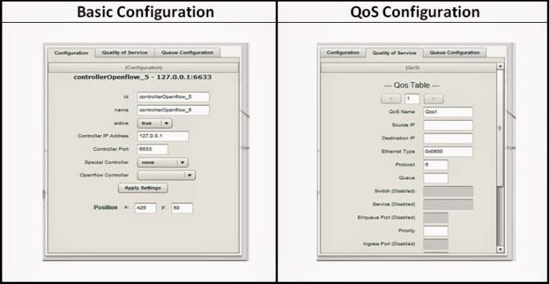
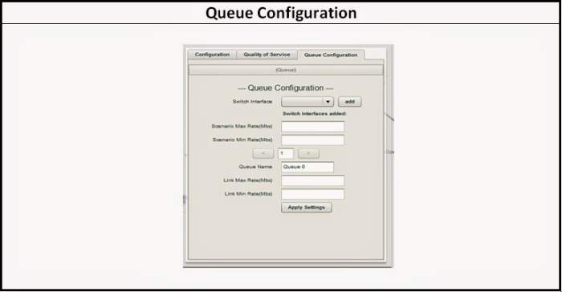
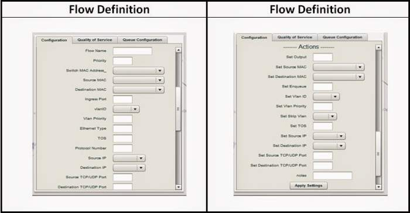
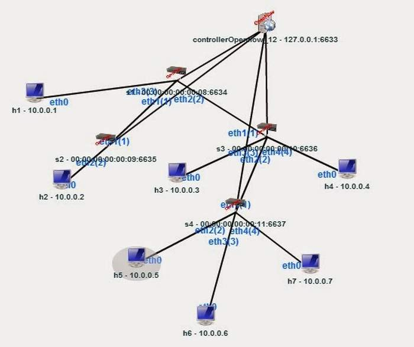
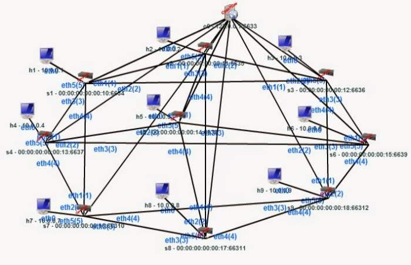
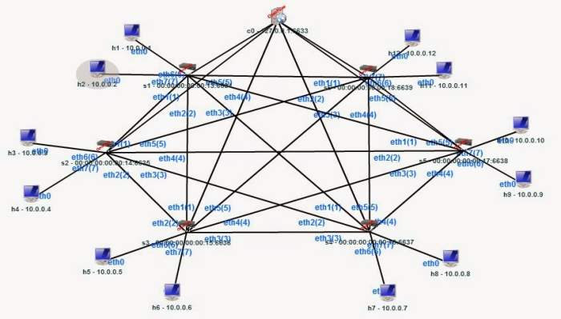

# Mininet - Eksperimen Topologi

*Dwina Fitriyandini Siswanto, Siti Amatullah Karimah*

Pada Mininet sudah terdapat beberapa topologi bawaan yang dapat langsung digunakan dengan menggunakan perintah (*command*) tertentu. Beberapa topologi bawaan tersebut antara lain topologi *single*, *tree* dan *linear*.


Pada eksperimen ini dilakukan pembangunan topologi diluar ketiga topologi diatas atau bisa disebut dengan topologi bebas atau *custom topology*.

## Topologi Bebas (*Custom Topo*)
Membuat *custom topology* dapat dilakukan dengan 2 cara, yaitu secara manual dengan menulis kode python atau membuat konfigurasi topologi menggunakan GUI editor seperti *Virtual Network Description* (vnd) kemudian diexport ke bentuk *file* yang dapat di-*running* oleh mininet.

- Membuat custom topology manual pada mininet
   1. Buatlah file *.py* dari topologi yang diinginkan kemudian simpan di folder *mininet/custom/*
   2. Setelah membuat file *.py* kemudian *run* *custom topology* yang telah dibuat menggunakan *command* :
`$ sudo mn --custom <custom_topology> --topo mytopo --mac --switch ovsk --controller remote`


- Membuat *custom topology* dengan vnd pada via situs http://www.ramonfontes.com/vnd/
  1. Buatlah topologi yang diinginkan
  2. Klik ***File*>*Export*>*Export to mininet***, kemudian ubah format file menjadi .py
  3. Pada mininet, *copy* file ke dalam folder *mininet/examples*
  4. Buat agar file vnd dapat dieksekusi oleh mininet dengan
     `$ chmod +x <file_topology_vnd>`
  5. Jalankan file menggunakan command
	`$ sudo ./<file_topology_vnd>`

Ketika membuat *custom topology* pada vnd, terdapat beberapa fitur pendefinisian yang dibawa oleh vnd. Diantaranya sebagai berikut :








## Menjalankan POX Controller
Sebelum menjalankan *custom topology* jalankan *controller* yang digunakan. Pada eksperimen ini *controller* yang digunakan ialah POX controller.

Berikut contoh cara menjalankan POX controller dalam mininet:
```bash
cd /home/ubuntu/pox && ./pox.py log.level --DEBUG forwarding.tutorial_I2_hub
```

## Eksperimen Custom Topology
Pada eksperimen ini dibuat 5 *custom topology* yang masing-masingnya dibangun menggunakan 2 cara yang dijelaskan sebelumnya yakni secara manual dan juga mengunakan vnd. Berikut 5 jenis topologi yang dibangun,


**1. 01_custom_topo**



- Menjalankan custom topology yang telah dibuat di mininet


- Menjalankan custom topology yang telah dibuat di vnd


**2.	02_custom_topo**


**3.	2d_mesh_topo**


**4. 2d_torus_topo**



**5. full_connect_topo**



##Referensi

1. TBA
2. ...

##Lisensi
*CC Attribution-NonCommercial-NoDerivatives*
[(Lisensi)](http://creativecommons.org/licenses/by-nc-nd/4.0/)
