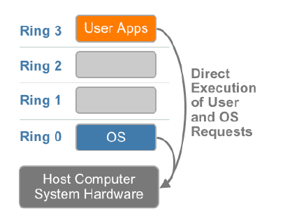
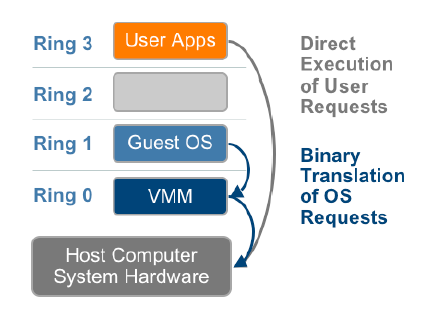

# Virtualisasi dan Hypervisor

Teknologi **Virtualisasi** adalah landasan bagi tumbuh dan berkembangnya ***OpenStack***. Pada hakikatnya OpenStack tidak lain adalah suatu kerangka kerja bagaimana mengatur dan mendayagunakan teknologi virtualisasi yang berkembang terus agar penggunaannya baik dalam skala kecil maupun dalam skala yang luar biasa besar *tetap terkontrol* dan *mudah dilakukan*.

#### Definisi Virtualisasi
Virtualisasi adalah membuat versi maya (*virtual*) dari suatu sumber daya (*resource*) sehingga pada satu sumber daya fisik dapat dijalankan atau disimpan beberapa sumber daya maya sekaligus, dengan syarat unjuk kerja masing-masing sumber daya maya itu tidak berbeda signifikan dengan sumber daya fisiknya.

Hingga saat ini sumber daya yang terlah dapat *divirtualisasikan* antara lain adalah perangkat keras komputer (*hardware*), media penyimpan data (*storage*), operating system (*os*), layanan jaringan (*networking*) dan daftar ini masih bertambah terus.

Virtualisasi ini dimungkinkan karena perkembangan teknologi hardware yang sedemikian pesat sehingga kemampuan sebuah sumber daya fisik berada jauh di atas tuntutan penggunaannya sehinga sebagian besar waktu atau kapasitasnya tidak terpakai (*idle*).

Kapasitas atau kemampuan lebih ini didayagunakan dengan menjalankan atau menyimpan beberapa sumber daya maya (tergantung pada kemampuan dan kapasitas sumber daya tersebut dan beban kerjanya) sehingga dapat menghasilkan efisiensi yang lebih tinggi.

#### Definisi Hypervisor
Secara teknis virtualisasi diwujudkan dengan menambahkan satu bagian (*layer*) perangkat lunak (*software*) yang disebut dengan nama ***hypervisor***.

Hypervisor ini berfungsi sebagai ***Virtual Machine Manager*** (VMM) yaitu bagian yang melakukan abstraksi dari perangkat keras fisik menjadi perangkat keras virtual dalam rangka mendistribusikan beban kerja dari semua mesin virtual (***VM***) ke masing-masing perangkat keras secara proporsional.

## Virtualisasi pada keluarga komputer yang berarsitektur x86
Pada awalnya virtualisasi pada keluarga komputer yang berarsitektur x86 dianggap sulit direalisasikan karena prosesor x86 memiliki arsitektur yang dapat digambarkan dengan bagan seperti di bawah ini :

Prosesor x86 membagi tingkatan akses menjadi 4 tingkat yang dinamai *Ring 0, 1, 2*, dan *3*. **Ring 0** adalah satu-satunya tingkatan yang memungkinkan dijalankannya perintah-perintah untuk mengakses memori atau perangkat keras lainnya secara langsung.

Ring yang lain tidak dapat menjalankan perintah-perintah untuk mengakses memori dan perangkat keras secara langsung. Software yang dijalankan pada Ring 1, 2, dan 3 dibatasi aksesnya ke hardware untuk alasan keamanan sistem yang ketat. Akses hardware dari Ring selain Ring 0 akan diseleksi terlebih dahulu dan apabila diijinkan akan didelegasikan melalui Ring 0 dengan mendapatkan pengawalan yang sangat ketat.

Idealnya virtualisasi dapat dilakukan dengan mudah dengan cara menempatkan hypervisor pada Ring 0 dan OS minimal di Ring 1. Akan tetapi OS perlu mengakses memori dan perangkat keras lainnya secara langsung. Dalam kondisi biasa OS menempati Ring 0 dan tidak ada masalah. Bila OS harus digeser ke Ring 1 maka timbul masalah akses. Sehingga tantangan terbesar virtualisasi dalam keluarga komputer yang berarsitektur x86 adalah bagaimana membuat sebuah hypervisor yang dapat dijalankan di Ring 0 akan tetapi tidak menghalangi akses dari OS yang digeser dari Ring 0 ke Ring 1.

Ada beberapa cara yang dilakukan untuk mewujudkan hal tersebut yang mengakibatkan pada akhirnya muncul beberapa jenis hypervisor juga. Implikasinya ada tiga macam teknologi virtualisasi yang saat ini bersaing di pasar, yaitu :
* **Virtualisasi Total** dengan cara translasi biner
* **Paravirtualisasi** dengan modifikasi OS
* **Virtualisasi** dengan bantuan perangkat keras.

#### Virtualisasi Total dengan cara translasi biner
virtualisasi total sementara ini adalah cara virtualisasi yang paling sulit. Implementasinya adalah dengan membuat hypervisor yang beroperasi di Ring 0 dan menggeser OS ke Ring 1. Setiap perintah yang mengakses memori atau perangkat keras lainnya yang dijalankan di Ring 1 dihadang terlebih dahulu agar supaya tidak menimbulkan "error" dengan cara ditranslasikan menjadi perintah yang efeknya sama seperti yang dikehendaki tetapi dijalankan oleh hypervisor yang berada di Ring 0.
Sementara itu aplikasi yang dijalankan di Ring 3 karena tidak mengandung perintah yang mengakses memori atau hardware secara langsung dapat dieksekusi langsung tanpa interverensi dari hypervisor. Bagannya dapat dilihat seperti di bawah ini :

Keunggulan utama teknologi ini adalah tidak perlu ada perubahan pada guest OS dan dapat dijalankan di semua jenis prosesor x86 tanpa perlu fitur khusus.

Contoh implementasi dari teknologi ini adalah pada hypervisor vMWare ESX dan Microsoft Virtual Server.

#### Paravirtualisasi
Berbeda dengan virtualisasi total yang tidak memerlukan perubahan pada *guest OS* maka pada paravirtualisasi teknologi hypervisor yang diimplementasikan adalah dengan cara mengubah kernel dari *guest OS* menjadi kernel yang memahami virtualisasi. Hal ini dilakukan dengan mengubah perintah-perintah yang mengakses memori dan perangkat keras secara langsung menjadi sebuah ***hypercall*** yaitu perintah yang mengakses hypervisor (*virtualization layer*) yang mengatur implementasi virtualisasi.

Karena teknologi ini perlu mengubah kernel *guest os* maka pada awalnya paravirtualisasi tidak dapat menjalankan Windows sebagai *guest OS*, karena Windows adalah OS yang tidak *open source*. Bagan dari paravirtualisasi dapat dilihat pada gambar di bawah ini :

Teknologi paravirtualisasi ini kita jumpai pada [xen](http://www.xenproject.org) yang antara lain dipergunakan oleh Oracle VM Server dan Citrix Xen Server. Untuk mengatasi kendala menjalankan Windows sebagai *guest os* maka akhir-akhir ini xen mengadopsi juga teknologi virtualisasi dengan bantuan perangkat keras sebagai bagian dari teknologi paravirtualisasinya.

Kelebihan utama dari teknologi paravirtualisasi ini adalah mengubah kernel *guest os* lebih mudah daripada membuat translasi biner seperti pada teknologi virtualisasi total, selain itu perbedaan unjuk kerja dari mesin virtual dan tidak sangat kecil (hampir tidak ada perbedaan).

